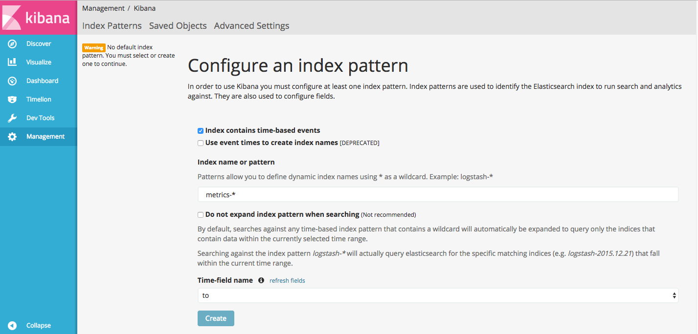
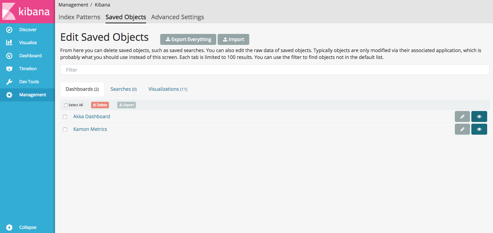

# Kamon-logstash backend module

[Kamon](http://kamon.io/) is a very useful monitoring tool for JVM. 
It provides a few backend options. 
The module on this repository represents a way to use [ELK](https://www.elastic.co/webinars/introduction-elk-stack)(Elasticsearch-Logstash-Kibana) as the backend and visualization for the data collected by Kamon.

# Overview

This repository contains:

- Kamon-logstash module: (./modules/kamon-logstash) Contains the code needed to communicate with Kamon and push the collected statistics to Logstash.
- Sample Akka-based app: (./modules/actors-to-monitor) This module is an example of a Akka-based application we want to monitor. It is a copy of the code provided by the Akka team as a [Fault Tolerance Sample.](http://doc.akka.io/docs/akka/current/scala/fault-tolerance-sample.html#full-source-code-of-the-fault-tolerance-sample)
- Docker samples: (./Docker) Provides sample configuration of the ELK stack using Docker to test the Kamon-logstash module and to provide the necessary Elasticsearch index mapping.

# Installation

To install this module, the first step is to add the following dependency to your `build.sbt`:

```
libraryDependencies += "com.codekeepersinc" %% "kamonlogstash" % "0.0.1"
```

The second step is to add the module's Akka extension on your configuration:

```
akka {
  ...
  
  extensions = ["com.codekeepersinc.kamonlogstash.KamonLogstash"]
}
```

The reference configuration of the module can be seen on [reference.conf.](./modules/kamon-logstash/src/main/resources/reference.conf)
Here it is as well with comments to clarify the parameters:

```
kamon {
  logstash {

    address = localhost                     # Logstash host
    port = 4570                             # Logstash port
 
    appname = application                   # Application name
    appname = ${?APPLICATION_NAME}          # It could be overwriten with the APPLICATION_NAME enviroment variable.

    hostname = localhost                    # Hostname to use on the data.
    hostname = ${?HOSTNAME}                 # It could be overwritten with the HOSTNAME environment variable

    retry {                                 # Failures are unavoidable and Logstash could not be there when we call. This section controls the retry policy.
      minBackoff = 1 second                 # Minimum time to wait before retrying to connect.
      maxBackoff = 10 seconds               # Maximum time to wait before retrying to connect.
      randomFactor = 0.2                    # Random factor added to make it less predictable and give Logstash time it is overwhelmed.
      retryAutoReset = 3 seconds            # Time to consider the system "healthy" and reset the internal retry counter.
    }

    # Subscription patterns used to select which metrics will be pushed to Logstash. Note that first, metrics
    # collection for your desired entities must be activated under the kamon.metrics.filters settings.
    subscriptions {
      histogram = ["**"]
      min-max-counter = ["**"]
      gauge = ["**"]
      counter = ["**"]
      trace = ["**"]
      trace-segment = ["**"]
      akka-actor = ["**"]
      akka-dispatcher = ["**"]
      akka-router = ["**"]
      system-metric = ["**"]
      http-server = ["**"]
    }
  }
}
```

## Retry policy

As failures are unavoidable, the module provides a simple retry policy based on the [Supervision and Monitoring](http://doc.akka.io/docs/akka/current/general/supervision.html) Akka documentation. 
[Akka Tcp](http://doc.akka.io/docs/akka/current/scala/io-tcp.html) provides a way to deal with errors without making actors fail due to exceptions, and that is why another implementation is in place here.
In the case of a communication error, the module will retry after a period (configurable with kamon.logstash.retry.minBackoff), then it will retry in an exponential increment until it reaches the maximum (configurable with kamon.logstash.retry.maxBackoff).
It will continue retrying with the maximum 30 times after(it is the "magic" number found Akka's BackoffSupervisor code).
  
# Setting up ELK stack

When the sample Akka-based app (./modules/actors-to-monitor) starts, it will be sending Kamon data to the Logstash instance at "localhost:4570", and there is a few configuration needed on the ELK side to start visualizing that data.
To see the configuration and to have an ELK environment up using Docker(I am assuming Docker, and Docker Compose is installed on your system, if they are not, please [follow Docker installation instructions](https://docs.docker.com/engine/installation/)), we need to run the following command on the ./Docker directory:

```
docker-compose -f dev-containers.yml -p kamon up -d --build
```

It will create four containers and three images on your local Docker:

- kamon_elasticsearch-seed_1 and kamon_elasticsearch-node_1: Conform an Elasticsearch two nodes cluster named kamon-cluster (image elasticsearch-kamon created from ./Docker/Elasticsearch).
- kamon_logstash-log_1: Logstash instance configured to accept logs (image logstash-log created from ./Docker/Logstash-Log).
- kamon_kibana_1: Kibana instance created from the library's kibana image. Configured to connect to the above Elasticsearch cluster, and exposing the standard port 5601 on the host.
- kamon_logstash-metric_1: Logstash instance configured to accept the Kamon data the module will be sending (image logstash-metric created from ./Docker/Logstash-Metric).

The last container is the one we will be using most on this module, but the others are needed as part of the ELK stack. (Ok, the logstash-logs is not needed, but it is good to have it anyways.)
The [logstash.yml](./Docker/Logstash-Metric/logstash.yml) for that container is:

```
input {
    tcp {
        port => 4560
        codec => json_lines
    }
}

output {
    elasticsearch {
        hosts => [ "http://elasticsearch-seed:9200" ]
        document_type => "metric"
        retry_on_conflict => "3"
        index => "metrics-%{+YYYY.MM.dd}"
        template => "/usr/share/logstash/metric-template.json"
        template_name => "kamon-metric"
    }
}
```

It configures the pipeline to accept json lines at port 4560 (on the container) as input, and output to the Elasticsearch cluster. 
The [index template mapping](./Docker/Logstash-Metric/metric-template.json) is really important. It could be improved for further use. The one used here is a basic configuration:

When everything is up you can go to [Kibana's status](http://localhost:5601/status) to see everything is green(it takes a while sometimes, depending on your system):


Run the sample app to get some data in with the following command on the repo root:

```
sbt actorsToMonitor/run
```

There is no API to configure Kibana's index pattern I could find. We need to click on the "Management" link on the side menu, and then click on "Index Patterns" to get to this page:


Change the pattern from "logstash-*" to "metrics-*", and select the Time-field name "to" from the dropbox.



Click the "Create" button, and leave the default fields.

Now, we are ready for some visualizations. Click on the "Saved Objects" tab, click on the "Import" button and select the file ./Docker/sample-dashboard.json.
This will give you some visualizations and dashboards to start with:



Click on "Dashboard" on the left menu, and then "Open" from the top menu. Select "Akka Dashboard":


And then, click again on "Open" to see the "Kamon Metric" dashboard. This one will show information about the data stored by the module. It could be good starting point to understand that data better and create new dashboards for your needs.

